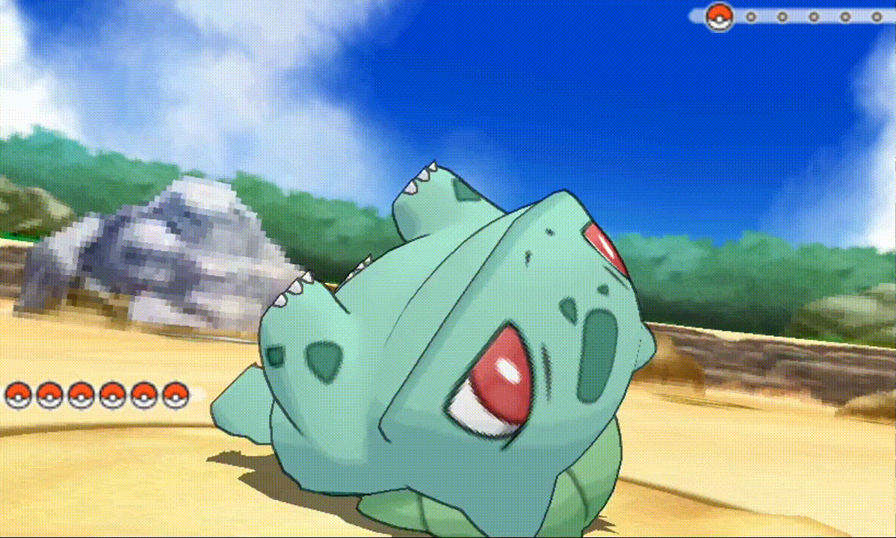
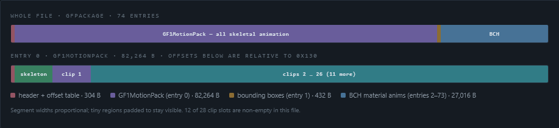
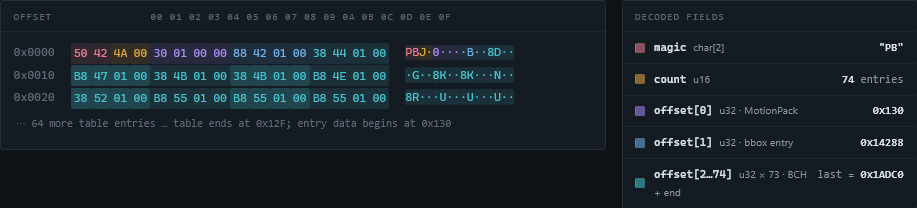
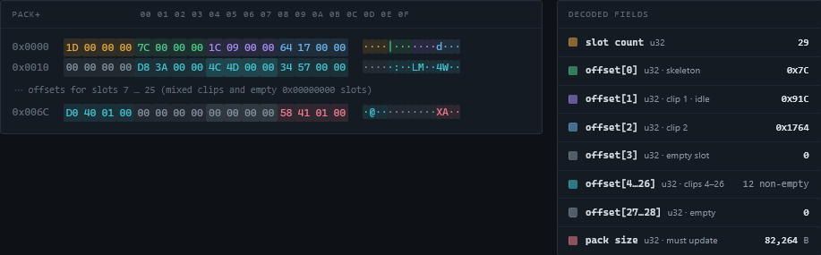

  

  <strong>a poc custom animation in pokemon oras</strong>

  For an interactive version, <a href="https://drizz1le.github.io/gf1motion">visit my site</a> 
    Readme is the same, but can always be found here for archival purposes  

  <a href="#before--after">See it</a> ·
  <a href="#install">Install</a> ·
  <a href="#pick-your-grunt">Levels</a> ·
  <a href="#what-you-get">What you get</a> ·
  <a href="#benchmarks">Benchmarks</a> ·
  <a href="#the-whole-cave">Ecosystem</a> ·
  <a href="#caveman-2">Caveman 2</a>

Pokémon X/Y · ORAS  //  GF1Motion skeletal animation

# .PB Byte Atlas — every region of an animation file, highlighted

`GARC a/0/0/8` `dec_0008.PB`  `Bulbasaur` `110,016 B`

Every byte shown below is **real data** read from the file above at the stated offsets — nothing is mocked up. The format nests four layers: a **GFPackage** container → a **GF1MotionPack** → a **GF1MotBone** skeleton → **GF1Motion** clips. Hover any legend row or any colored byte to light up its field. All integers are little-endian.

## Where everything lives

LAYER 1

## GFPackage container

abs 0x0000

Two-byte magic, entry count, then `count + 1` absolute offsets — the extra final offset is the file size, so entry *i* always spans `offset[i] … offset[i+1]` and zero-length entries are legal. Entry 0 is the motion pack; entry 1 is bounding-box data; entries 2+ are BCH material/visibility animations.

LAYER 2

## GF1MotionPack header

pack+0x000 · abs 0x130

A slot count, then one offset per slot — **relative to the pack start**. Slot 0 is the skeleton; slots 1–28 are animation clips keyed to fixed roles (idle, attack, faint …). An offset of `0` means the slot is empty. Immediately after the table sits the pack's total size, which must be recomputed whenever a clip changes length.

LAYER 3

## GF1MotBone skeleton

pack+0x07C

Bone count, per-bone records (parent / flags / child-count), null-terminated names, 4-byte alignment padding, then a 28-byte rest pose per bone (translation + quaternion). Bone 0 is an implicit `Origin` root with no record or name — only a rest pose. Clips never store bone names: channels bind to bones **by index**, so bone order is sacred.

pack+00 01 02 03 04 05 06 07 08 09 0A 0B 0C 0D 0E 0F

decoded fields

LAYER 4

## GF1Motion clip — the interesting part

pack+0x91C · clip 1 · idle

Each clip animates 9 channels per bone (TXYZ, RXYZ, SXYZ; rotations are Euler XYZ in radians) and packs them in four sections: **header → octal stream → keyframe index tables → float data**. Clip 1 here: `42` frames, 42 animated bones, 3,656 bytes total.

Clip 1 anatomy · pack+0x91C … 0x1764 · 3,656 B

### 4.1  Header + octal stream 3-bit codes, 8 per 3 bytes

After a 4-byte header, a stream of 3-bit “octal” codes assigns a storage strategy to every channel. Walking bones in skeleton order, each group of 3 channels (T, R, S) is either skipped with a single `1`, or expanded into 3 per-channel codes. The stream opens with two dummy `0` codes.

pack+00 01 02 03 04 05 06 07 08 09 0A 0B 0C 0D 0E 0F

decoded fields

Unpacking one 3-byte group  ·  pack+0x920

**4092FF** → little-endian 24-bit → 0xFF9240 = 111111111001001001000000₂ → eight 3-bit codes, low bits first →

000

0

dummy

000

0

dummy

001

1

Origin · T  
skip group

001

1

Origin · R  
skip group

001

1

Origin · S  
skip group

111

7

Waist · TX  
hermite keys

111

7

Waist · TY  
hermite keys

111

7

Waist · TZ  
hermite keys

The very first group of this clip already tells a story: the **Origin** bone is completely unanimated (three skips), and **Waist** — the root of the visible body — gets fully keyframed hermite translation.

| code | meaning                                | data consumed               |
|------|----------------------------------------|-----------------------------|
| 0    | constant **0.0**                       | —                           |
| 1    | **skip 3 channels** (group level only) | —                           |
| 2    | constant **+π/2**                      | —                           |
| 3    | constant **π**                         | —                           |
| 4    | constant **−π/2**                      | —                           |
| 5    | constant, custom value                 | 1 float                     |
| 6    | keyframed · **linear**                 | 1 kf table + 1 float / key  |
| 7    | keyframed · **hermite**                | 1 kf table + 2 floats / key |

### Code usage · clip 1

278 codes (incl. 2 dummies)

### 4.2  Keyframe index tables one per code-6/7 channel, in stream order

Each table is a count of **interior** keyframes followed by their frame numbers — frames `0` and `frame_count` are implicit, so every keyframed channel has `N + 2` keys. Entries are `u8` here because `frame_count ≤ 255`; longer clips switch to `u16` (2-byte aligned). Zero-padded to 4 bytes at the end.

pack+00 01 02 03 04 05 06 07 08 09 0A 0B 0C 0D 0E 0F

decoded tables

### 4.3  Float data IEEE-754 · consumed in stream order

Code-5 channels take one float; code-6 one per key; code-7 a **(value, slope)** pair per key, where the slope is the hermite tangent. Below: the first channel’s data — **Waist · TX**, keys at frames 0 / 21 / 42 — followed by the start of Waist · TY. Note TY’s first value, `19.7167`, sitting right at Waist’s rest-pose height of `19.786`.

pack+00 01 02 03 04 05 06 07 08 09 0A 0B 0C 0D 0E 0F

decoded floats

Format reverse-engineered from SPICA (`GF1Motion.cs`, `GF1MotBone.cs`, `GF1MotionPack.cs`, `GFPackage.cs`) and verified by byte-exact round-trips with `anim.py` — export → patch → export reproduces identical JSON, with only low-order float bits differing from 7-decimal export rounding. Companion prose spec: `ANIM_FORMAT.md`. Pipeline: GARC `a/0/0/8` → LZ11 decompress → edit → LZ11 compress → repack → Luma3DS LayeredFS.